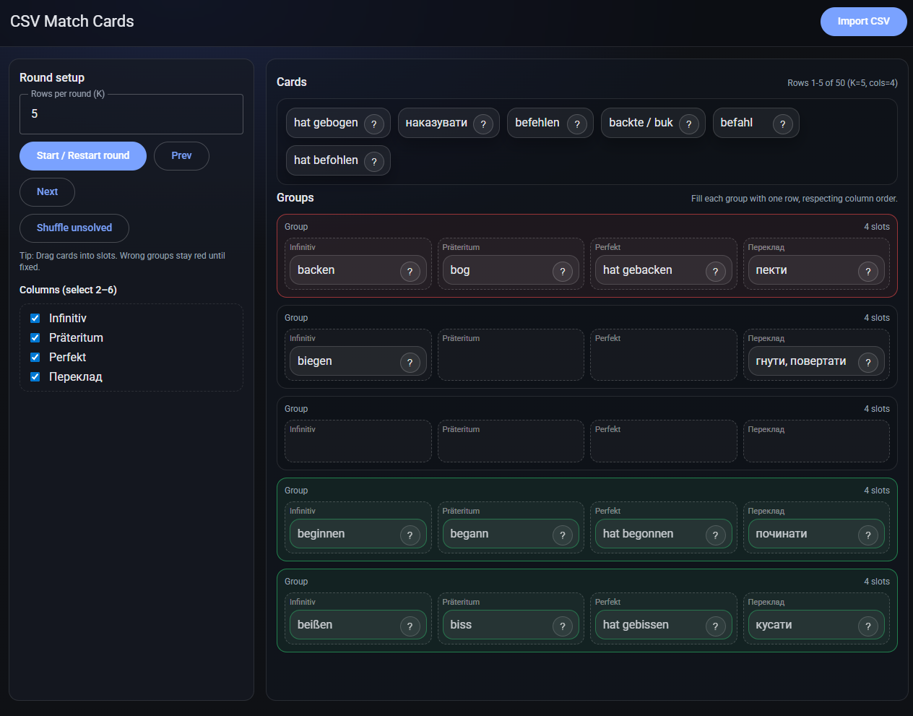
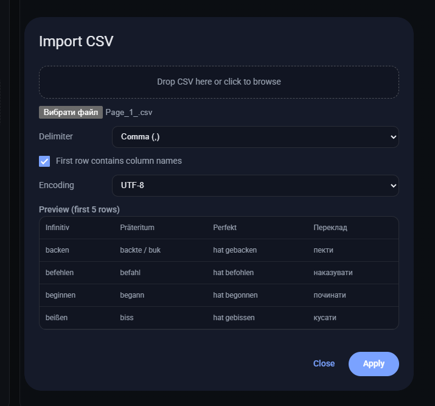

<div align="center">
  <h3 align="center">CSV Match Cards</h3>

  <p align="center">
    A lightweight single-page matching game for language learning.
    <br />
    Import a CSV (or generate with AI) → drag & drop cards to match rows.
    <br /><br />
    <a href="https://kamelotmarmot.github.io/CardMatch/"><strong>View Demo »</strong></a>
    ·
    <a href="https://github.com/KaMeLoTmArMoT/CardMatch/issues">Report Bug</a>
  </p>
</div>

## About

CSV Match Cards turns CSV rows into draggable cards. The goal is to build correct groups: each group must contain cards from the same CSV row, in the chosen column order.

<p align="center">
   
</p>

## Features

- **CSV import** with 5-row preview, configurable delimiter, header row and encoding (UTF-8 / Windows-1252 / ISO-8859-1).
- **AI Card Generator** (bring-your-own Mistral key, model `mistral-medium-2508`): pick a preset or theme, choose column/row counts, and generate a dataset directly into the round setup. Optional PIN/passphrase encryption of the stored API key.
- **Rounds**: choose rows per round (K) and columns (2–6), with prev/next/shuffle.
- **Drag & drop** on desktop and touch devices; `?` hint highlights sibling cards from the same row; solved groups lock and move to the bottom with a success flash.
- **Mobile-friendly** responsive layout.

## Tech Stack

- **Vite** + **TypeScript** (strict mode), bundled static build.
- **Material Web Components** (Material Design 3) and **PapaParse** — npm dependencies, no CDN.
- **Biome** for linting/formatting.

## Getting Started

Requirements: Node.js 20+.

```bash
npm install     # install dependencies
npm run dev     # dev server (LAN, http://localhost:5173)
npm run build   # type-check + production build into dist/
npm run preview # serve the production build locally
```

Useful while developing:

```bash
npx tsc --noEmit  # type-check only
npm run lint      # Biome check
npm run format    # auto-format
```

## Usage

1. Open the app (dev server, `npm run preview`, or the GitHub Pages demo).
2. Click **Import CSV** (or drop the file into the dropzone).
   <p align="center">
      
   </p>
3. Enable "First row contains column names" if your CSV has headers, pick the delimiter if needed, then **Apply**.
4. Select 2–6 columns, set **Rows per round (K)**, and click **Start / Restart round**.
5. Drag cards into group slots — green = correct group, red = incorrect.

### AI Generation

1. Click **✨ AI Generate**.
2. Enter your Mistral API key (optionally a PIN/passphrase to encrypt it in `localStorage`).
3. Pick a preset or type a theme, adjust columns (2–6) and rows (5–30).
4. **Generate Cards** — the dataset loads into the round setup, ready to play.

### CSV Format

Any rectangular CSV works. Each selected column becomes one card:

```csv
de,en
Haus,house
Baum,tree
```

```csv
present,past,future
go,went,will go
```

Sample file: [Unregelmäßige Verben (4 columns)](examples/irregular_verbs_de.csv)

## Deployment

GitHub Pages deployment runs manually via the **Actions** tab → *Deploy to GitHub Pages* → *Run workflow*. It builds the app and publishes `dist/` to Pages.

## Project Structure

```text
index.html            # App shell (Material Web components)
src/
  main.ts             # Entry point: element refs, event wiring
  types.ts            # Card, Group, GameState, Mistral types
  state.ts            # Reactive game state + helpers
  csv.ts              # PapaParse import/preview/apply
  game.ts             # Board rendering, drag & drop, rounds, groups
  mistral.ts          # Mistral API client + prompt builder
  crypto.ts           # Web Crypto (PBKDF2 + AES-GCM) key helpers
  els.ts              # Typed DOM element references
  styles.css          # App styles
.github/workflows/    # GitHub Pages deployment
```

## License

MIT — see [`LICENSE`](LICENSE).
